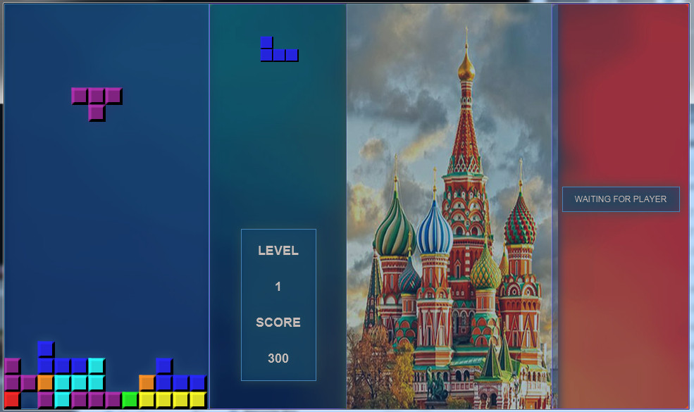
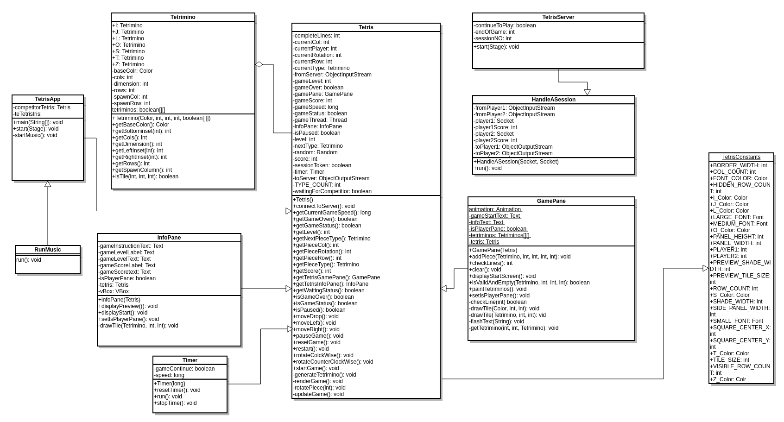
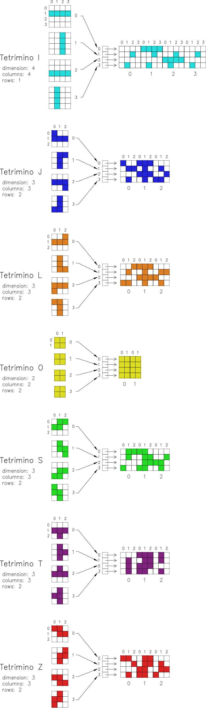

# Network two-player Tetris

### Java project

The project is a work in progress multi-player network version of the game Tetris in client/server
architecture and deploy on muttiple platforms. A Server matches players in the sequence of starting game and game states are passed as Serialized Object to be displayed on individual player screens.

TetrisApp.java - Tetris app

TetrisServer - Tetris server

## screenshot

## UML Class Diagram

## Encode Tetriminos tiles rotations in Arrays

